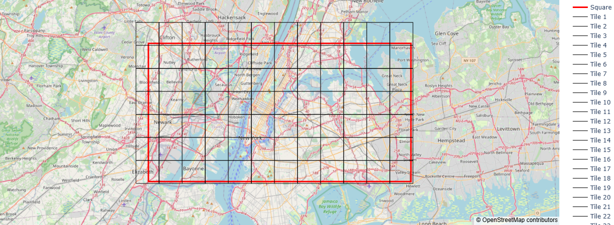

# GeoIters


A simple package for geospatial iterators.

## Installation

```bash
pip install geoiters
```

## Usage

### 1. Grid Iterator
#### Grid by Rows and Columns
```python
from geoiters.grid import GridIterator
from geoiters.utils import Extent

ext = Extent(-74.2, 40.65, -73.7, 40.85, crs="EPSG:4326")
itr = GridIterator(ext, rows=10, columns=10)

for i, patch in enumerate(itr):
    print(i, patch)
```
See the complete example [here](examples/by_rows_and_columns.py).

<br />


#### Grid by Max Patch Area
```python
from geoiters.grid import GridIterator
from geoiters.utils import Extent

ext = Extent(-74.2, 40.65, -73.7, 40.85, crs="EPSG:4326")
itr = GridIterator(ext, patch_max_area=10_000_000) # area in sqm

for i, patch in enumerate(itr):
    print(i, patch)
```
See the complete example [here](examples/by_max_patch_area.py).

<br />

#### To Use with Multiprocessing
```python
import time
import multiprocessing as mp
from geoiters.utils import Extent
from geoiters.grid import GridIterator

def worker(patch: Extent):
    time.sleep(1) # simulate a time-consuming task
    print(f"Worker {mp.current_process().name}: "
          f"Processing patch with extent {patch}")

ext = Extent(-74.2, 40.65, -73.7, 40.85, crs="EPSG:4326")
itr = GridIterator(ext, rows=4, columns=4)

pool = mp.Pool(processes=4)
pool.map(worker, itr)
pool.close()
pool.join()
```
See the complete example [here](examples/with_multiprocessing.py).
<br />

### 2. Tiles Iterator

```python
from geoiters.grid import TilesIterator
from geoiters.utils import Extent

ext = Extent(-74.2, 40.65, -73.7, 40.85, crs="EPSG:4326")
itr = TilesIterator(ext, zoom_level=13)

for i, tile in enumerate(itr):
    print(i, tile)
```
See the complete example [here](examples/tiles_iterator.py).

<br />


## Features
- Lightweight and easy to use.
- Efficient iteration over geospatial grids.
- Divide a geographical extent into patches and iterate through them.
- Divide a geographical extent by the number of rows and the number of columns.
- Divide a geographical extent by the maximum area of a single patch.

## To be Implemented
- Implement a hexagonal tessellation iterator.
- Overlapping patches.
- Iteration order options (sequence, checkered, etc.)
